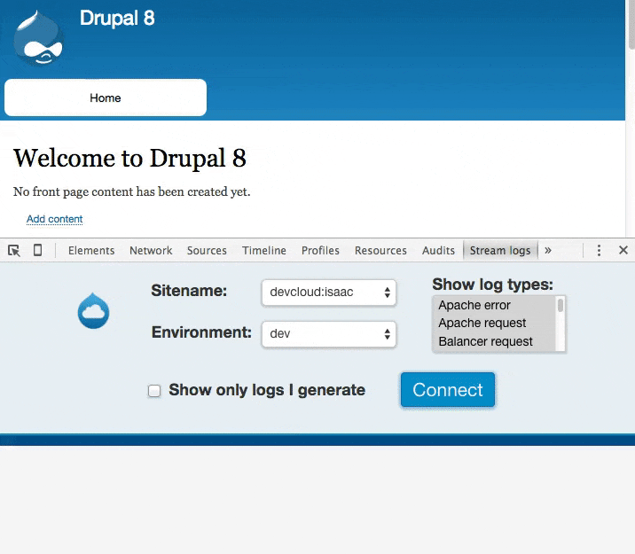

This Chrome extension allows you to see what logs are being generated in real
time as you browse around a website that you maintain on
[Acquia Cloud](https://www.acquia.com/products-services/acquia-cloud). This
works by using the
[log streaming feature](https://docs.acquia.com/cloud/configure/logging/stream).

## Usage

First, your website needs to be running on Acquia Cloud. If you don't have a
website on Acquia Cloud but you want to try this extension anyway, you can
[sign up for free](https://insight.acquia.com/free).

Second, you need to install the extension. You can do this the usual way from the
[Chrome Web Store](https://chrome.google.com/webstore/category/extensions) or,
for development or testing purposes, you can load this extension's code in
[developer mode](https://developer.chrome.com/extensions/getstarted#unpacked).

Third, you need to input your login credentials to Acquia Cloud in the
extension's settings. Note that these will be stored unencrypted on your local
machine (as are all passwords that Chrome remembers on your behalf) so be sure
to remove them when you're done if you are uncomfortable with that.

Fourth, navigate to the website from which you want to stream logs. Open the
Chrome Developer Tools (press `Ctrl + Shift + J` or navigate to
`≡ » More tools » Developer tools`) and switch to the "Stream logs" panel.

Finally, select the sitename and environment for the site you are
investigating, then click the "Connect" button to start streaming logs. You can
browse around your website and watch as the logs are generated in real time.

## Video

## TODO

- Re-record the video/gif
- Publish the extension and update the README to point to the extension on the Chrome Web Store
- Allow configuring the maximum number of log entries to keep: chrome.storage.sync.get({ 'elemcount_max': 100 } ...)

- Make filtering by log type and regex and user-generation operate on logs after they're written to the DOM instead of when they're streamed
- Improve the select widgets for sitename and environment to be searchable to accomodate people with lots of sites. There don't seem to be any vanilla JS frameworks for this though.
