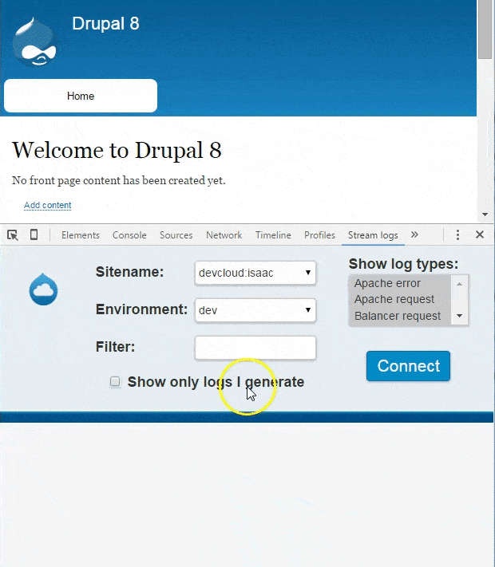

This Chrome extension allows you to see what logs are being generated in real
time as you browse around a website that you maintain on
[Acquia Cloud](https://www.acquia.com/products-services/acquia-cloud). This
works by using the
[log streaming feature](https://docs.acquia.com/cloud/configure/logging/stream).

## Setup

First, your website needs to be running on Acquia Cloud. If you don't have a
website on Acquia Cloud but you want to try this extension anyway, you can
[sign up for free](https://insight.acquia.com/free).

Second, you need to install the extension. You can do this from the
[Chrome Web Store](https://chrome.google.com/webstore/detail/logstream/pnpolgbojealkmfopnjlkaabicpdlhbg)
or [load it in developer mode](https://developer.chrome.com/extensions/getstarted#unpacked).

Third, you need to input your login credentials to Acquia Cloud in the
extension's settings.

## Usage

Navigate to the website from which you want to stream logs. Open the Chrome
Developer Tools (press `Ctrl + Shift + J` or navigate to
`≡ » More tools » Developer tools`) and switch to the "Stream logs" panel.

Select the sitename and environment for the site you are investigating, then
click the "Connect" button to start streaming logs. You can browse around your
website and watch as the logs are generated in real time.

Note that you can click on logs that are too long to fit in one line to expand
them. Also, the Filter box accepts regular expressions.

## Video

## TODO

- [Publish the extension](https://backlog.acquia.com/browse/IT-12978), [update who can access it](https://chrome.google.com/webstore/developer/edit/pnpolgbojealkmfopnjlkaabicpdlhbg), [update its ownership](https://blog.chromium.org/2013/08/group-based-publishing-in-chrome-web.html), and [update](https://backlog.acquia.com/browse/GIT-1389) the [repo settings](https://github.com/acquia/logstream-chrome)
